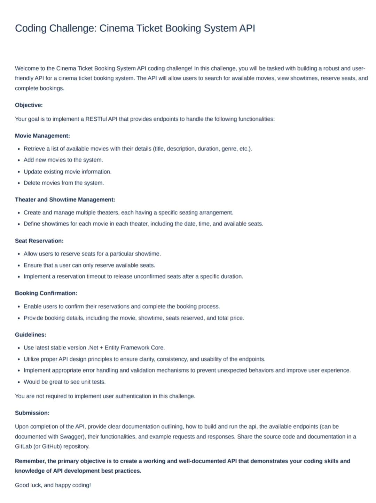

# CinemaBookingSystemApi

https://learn.microsoft.com/en-us/aspnet/core/tutorials/first-web-api?view=aspnetcore-8.0&tabs=visual-studio-code

## Challenge




# Setup, Build and Run

## Pre-reqs

### Store connection string in environment variables

Before running the API locally or in docker, store the connection string for your SQL DB in environment variables. Execute command:
```
nano ~/.zshrc
```

and add the following:
```
export CinemaBookingSystemConnection=<CONNECTION-STRING>
```

### SQL Migrations

You will also want to apply any out-standing migrations. Assuming you have completed the previous section.

Install the dotnet-ef tools if you haven't already:
```
dotnet tool install --global dotnet-ef
```

Then apply migrations:
```
dotnet ef database update 
```

To create a new migration run:
```
dotnet ef migrations add <NAME>
```

## Run application

### Run on local machine

```dotnet run --launch-profile https```

The default browser is launched to https://localhost:<port>/swagger/index.html, where <port> is the randomly chosen port number displayed in the output. There is no endpoint at https://localhost:<port>, so the browser returns HTTP 404 Not Found. Append /swagger to the URL, https://localhost:<port>/swagger.

### Run as container using Docker

Build image
```
docker build -t cinema-booking-system-api .
```

Run container, passing in CinemaBookingSystemConnection env from local machine
```
docker run -d -e CinemaBookingSystemConnection="${CinemaBookingSystemConnection}" -p 5001:5000 --name api-container cinema-booking-system-api
```

Or on Windows
```
docker run -d -e "CinemaBookingSystemConnection=$env:CinemaBookingSystemConnection" -p 5001:5000 --name api-container cinema-booking-system-api
```

Build and run using single command (on Windows)
```
docker build -t cinema-booking-system-api . && docker run -d -e "CinemaBookingSystemConnection=$env:CinemaBookingSystemConnection" -p 5001:5000 --name api-container cinema-booking-system-api
```

Access Swagger on http://localhost:5001/swagger

## Scaffold Controllers
```
dotnet aspnet-codegenerator controller -name MoviesController -async -api -m Movie -dc CinemaBookingSystemContext -outDir Controllers
```